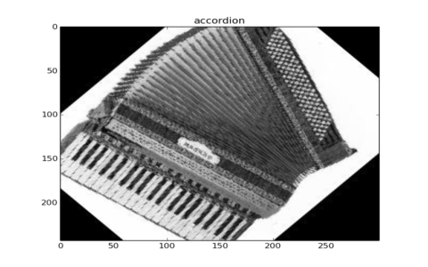
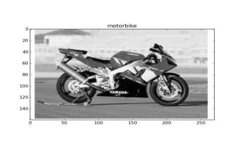
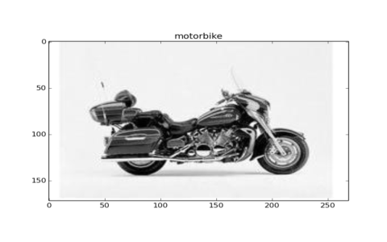
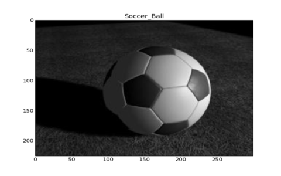
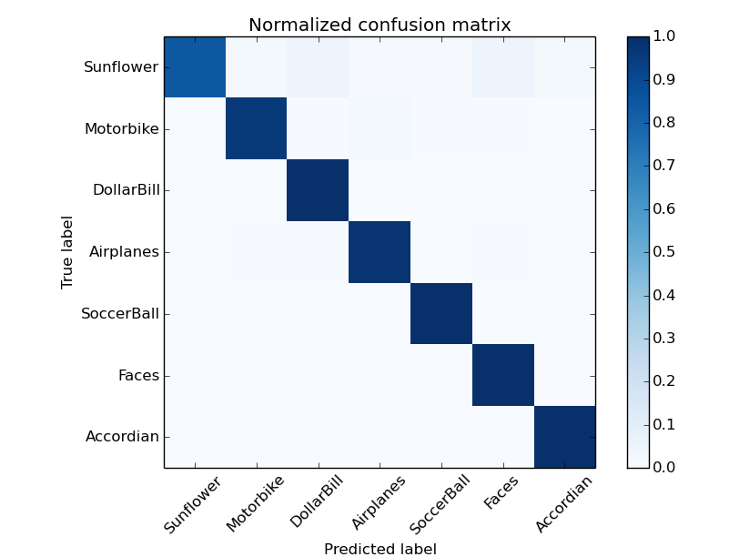

# Bag-of-Visual-Words-Python #

This is a python implementation of the Bag of Visual Words model. [Be sure to check it out on my blog](http://kushalvyas.github.io/BOV.html#BOV)

Project Architecture : 

	:::python 
	- root dir/
		|- images/
				|- test /
					|- obj1/
					|- obj2/

				|- train /
					|- obj1/
					|- obj2/

		|- helpers.py
		|- Bag.py 

	:~$ python Bag.py --train_path images/train/ --test_path images/test/

### Output

NOTE: I've added the MIT LICENSE to the repo. Anyone is free to use this code in accordance with the MIT LICENSE 
